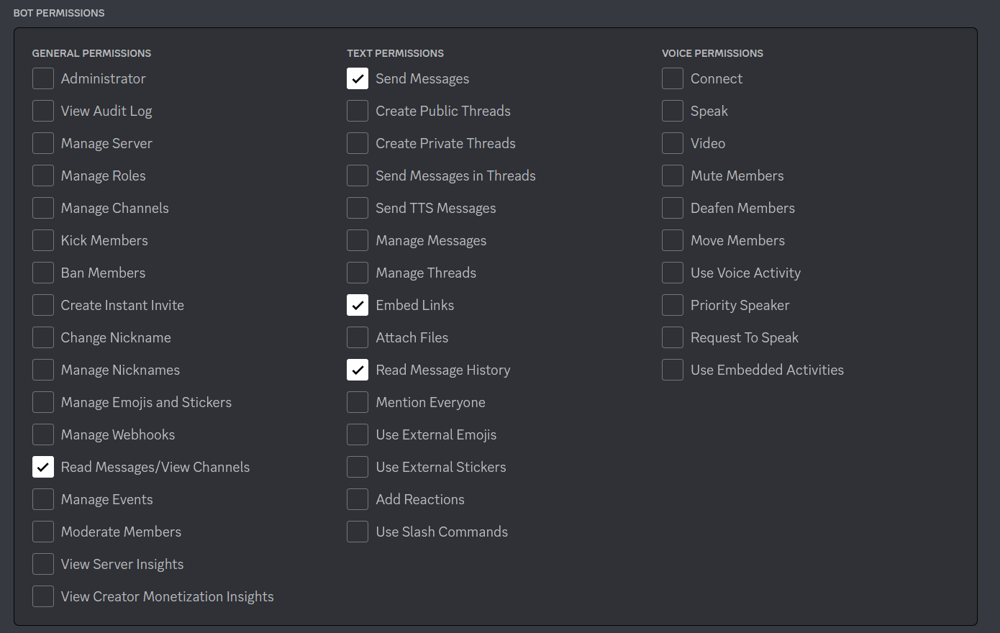

# AutoResponse-Bot

New `Eris` version, built on the Eris framework, check it out at [here](https://github.com/JayXTQ/AutoResponse-Bot/tree/eris)

AutoResponse-Bot is an open-source bot that can help you keep your server clean from people constantly asking the same questions over and over again. I know lot's of people have this issue which is why I made this option totally for free.

This tutorial may be hard for some newbies but hopefully you can understand it well enough that you don't have to open an issue!

The image reading function is currently in testing stages, hopefully as the system gets older the better it will get. Only time will tell

## Installation

To start, go ahead and download the code via the green code button. Download the ZIP file.

Once downloaded, extract the folder in a safe location (for me that would be Documents).

If you have extracted it correctly, you should see the whole repository in your directory.

Next go and create a file called `.env`, it must be exactly `.env` to work!

Inside that `.env` file, go ahead and type `TOKEN=` on the first line. Next you need to grab your Discord Bot token, if you don't know how to do that, check the next step.

Go to the [Discord Developer Portal](https://discord.com/developers/applications) and login if requested.

Create an application, or use one already made. You can do this by clicking `New Application` in the top right

Then click on the new app after you have given it a name and created it

Select `Bot` on the left side of your screen and make your application a bot if requested.

If you don't recieve a token, no need to worry, just click `Reset Token` and follow the steps to get your token!

Once you have your token, you should put it after `TOKEN=` inside your `.env` file. (Never give your token to anyone)

Whilst still on the bot page, scroll down until you see `Privileged Gateway Intents` and then enable `Message Content Intent`

You can then go to `OAuth2` on the left side of the bot page and click `URL Generator`, from here select `bot` and `applications.commands` then give your bot whatever permissions you want, required options are in the image below:

Then copy and paste the link given into your URL bar and add the bot to whatever servers you want. Yes, this works on multiple servers.

You can then open config.yml and update your `id` to your bot's ID which you can get by right clicking on your bot and clicking `Copy ID`

After you have your bot's ID set, you can change the rest of the config to your liking and start the bot. You can do that by going to where the repository is copied on your computer, copying the file location, going into PowerShell or Command Prompt, run `cd path/to/repository` and then run `node .`. Now the bot should have started if you did everything correctly!

The bot won't stay on forever by the way, as soon as you close Command Prompt or PowerShell, the bot will stop too.

To keep it on forever, you can put the bot on Discord Bot hosting but I won't explain that in much detail now other than it's mostly the same process